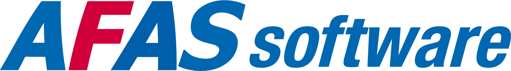

# HelloID-Conn-Prov-Target-AFAS-Profit-Users

> [!IMPORTANT]
> This repository contains the connector and configuration code only. The implementer is responsible to acquire the connection details such as username, password, certificate, etc. You might even need to sign a contract or agreement with the supplier before implementing this connector. Please contact the client's application manager to coordinate the connector requirements.

  

## Table of contents

- [HelloID-Conn-Prov-Target-AFAS-Profit-Users](#helloid-conn-prov-target-afas-profit-users)
  - [Table of contents](#table-of-contents)
  - [Introduction](#introduction)
  - [Getting started](#getting-started)
    - [Provisioning PowerShell V2 connector](#provisioning-powershell-v2-connector)
      - [Correlation configuration](#correlation-configuration)
      - [Field mapping](#field-mapping)
    - [Connection settings](#connection-settings)
    - [Prerequisites](#prerequisites)
    - [Remarks](#remarks)
      - [Scope](#scope)
  - [Setup the connector](#setup-the-connector)
  - [Getting help](#getting-help)
  - [HelloID docs](#helloid-docs)

## Introduction

_HelloID-Conn-Prov-Target-AFAS-Profit-Users_ is a _target_ connector. _AFAS-Profit-Users_ provides a interface to communicate with Profit through a set of GetConnectors, which is component that allows the creation of custom views on the Profit data. GetConnectors are based on a pre-defined 'data collection', which is an existing view based on the data inside the Profit database. 

| Endpoint                      | Description |
| ----------------------------- | ----------- |
| profitrestservices/connectors |             |

The following lifecycle actions are available:

| Action             | Description                                                                              |
| ------------------ | ---------------------------------------------------------------------------------------- |
| create.ps1         | PowerShell _create_ or _correlate_ lifecycle action. Create or correlate AFAS user       |
| delete.ps1         | PowerShell _delete_ lifecycle action. Block, remove from all groups and update AFAS user |
| disable.ps1        | PowerShell _disable_ lifecycle action. Block and optionally update AFAS user             |
| enable.ps1         | PowerShell _enable_ lifecycle action. Unblock and optionally update AFAS user            |
| update.ps1         | PowerShell _update_ lifecycle action. Update AFAS user                                   |
| configuration.json | Default _configuration.json_                                                             |
| fieldMapping.json  | Default _fieldMapping.json_                                                              |

## Getting started

By using this connector you will have the ability to update users in the AFAS Profit system.

Connecting to Profit is done using the app connector system. 
Please see the following pages from the AFAS Knowledge Base for more information.

[Create the APP connector](https://help.afas.nl/help/NL/SE/App_Apps_Custom_Add.htm)

[Manage the APP connector](https://help.afas.nl/help/NL/SE/App_Apps_Custom_Maint.htm)

[Manual add a token to the APP connector](https://help.afas.nl/help/NL/SE/App_Apps_Custom_Tokens_Manual.htm)

### Provisioning PowerShell V2 connector

#### Correlation configuration

The correlation configuration is used to specify which properties will be used to match an existing account within _{connectorName}_ to a person in _HelloID_.

To properly setup the correlation:

1. Open the `Correlation` tab.

2. Specify the following configuration:

    | Setting                   | Value        |
    | ------------------------- | ------------ |
    | Enable correlation        | `True`       |
    | Person correlation field  | ``           |
    | Account correlation field | `Medewerker` |

> [!TIP]
> _For more information on correlation, please refer to our correlation [documentation](https://docs.helloid.com/en/provisioning/target-systems/powershell-v2-target-systems/correlation.html) pages_.

#### Field mapping

The field mapping can be imported by using the [_fieldMapping.json_](./fieldMapping.json) file.

### Connection settings

The following settings are required to connect to the API.

| Setting                       | Description                                                                                                                                                                       | Mandatory |
| ----------------------------- | --------------------------------------------------------------------------------------------------------------------------------------------------------------------------------- | --------- |
| Base Uri                      | The URL to the AFAS environment REST services                                                                                                                                     | Yes       |
| Token in XML format           | The AppConnector token to connect to AFAS                                                                                                                                         | Yes       |
| Get Connector                 | The GetConnector in AFAS to query the user with                                                                                                                                   | Yes       |
| Update Connector              | The UpdateConnector in AFAS to update the user with                                                                                                                               | Yes       |
| Create account when not found | When toggled, if the user account is not found, a new the AFAS user account will be created in the create action (only in the create action).                                     |           |
| Update on update              | When toggled, if the mapped data differs from data in AFAS, the AFAS user will be updated when a update is triggerd.                                                              |           |
| Update User ID                | When toggled, the User ID will be updated if it doesn't match mapped naming convention. **Note that this is not advised as this can break certain links in AFAS. Use with care!** |           |
| Toggle debug logging          | When toggled, extra logging is shown. Note that this is only meant for debugging, please switch this off when in production.                                                      |           |

### Prerequisites

- [ ] HelloID Provisioning agent (cloud or on-prem).
- [ ] Loaded and available AFAS GetConnectors.
- [ ] In addition to use to the above get-connector, the connector also uses the following build-in Profit update-connectors:
*	KnUser
- [ ] AFAS App Connector with access to the GetConnectors and associated views.
  - [ ] Token for this AppConnector

> [!TIP]
> For this connector we have created a default set [Tools4ever - HelloID - T4E_HelloID_Users_v2.gcn], which can be imported directly into the AFAS Profit environment.

> [!NOTE]
> When the connector is defined as target system, only the following GetConnector is used by HelloID:
> * 	Tools4ever - HelloID - T4E_HelloID_Users_v2

### Remarks

> [!IMPORTANT]
> In view of GDPR, the persons private data, such as private email address and birthdate are not in the data collection by default. When needed for the implementation (e.g. set emailaddress with private email address on delete), these properties will have to be added.

> [!IMPORTANT]
> We never delete users in AFAS, we only clear the unique fields and block the users.

#### Scope
The data collection retrieved by the set of GetConnector's is sufficient for HelloID to provision persons.
The data collection can be changed by the customer itself to meet their requirements.

| Connector                                       | Field               | Default filter            |
| ----------------------------------------------- | ------------------- | ------------------------- |
| __Tools4ever - HelloID - T4E_HelloID_Users_v2__ | contract start date | <[Vandaag + 3 maanden]    |
|                                                 | contract end date   | >[Vandaag - 3 maanden];[] |

## Setup the connector

> [!TIP]
> Optionally, you can provide additional properties in `enable` and `disable` to update, e.g. **"EmAd", "Upn"**. The **default example sets these with the AD values**. This action is perfomed with **entry code "6"**. For more information on the entry codes, see the [AFAS documenation](https://help.afas.nl/help/en/SE/App_Conect_UpdDsc_KnUser.htm)

> [!TIP]
> `Update` with the specified properties, e.g. **"EmAd", "Upn"**, etc. The **default example sets these with the AD values**. This action is perfomed with **entry code "1"**. For more information on the entry codes, see the [AFAS documenation](https://help.afas.nl/help/en/SE/App_Conect_UpdDsc_KnUser.htm) 

> [!TIP]
> Optionally, you can provide additional properties in `delete` to update, e.g. **"EmAd", "Upn"**.  The **default example clears these values**, as the values have to be unique over all AFAS environments. This action is perfomed with **entry code "0"**. For more information on the entry codes, see the [AFAS documenation](https://help.afas.nl/help/en/SE/App_Conect_UpdDsc_KnUser.htm). |

## Getting help

> [!TIP]
> _For more information on how to configure a HelloID PowerShell connector, please refer to our [documentation](https://docs.helloid.com/en/provisioning/target-systems/powershell-v2-target-systems.html) pages_.

> [!TIP]
>  _If you need help, feel free to ask questions on our [forum](https://forum.helloid.com)_.

## HelloID docs

The official HelloID documentation can be found at: https://docs.helloid.com/
